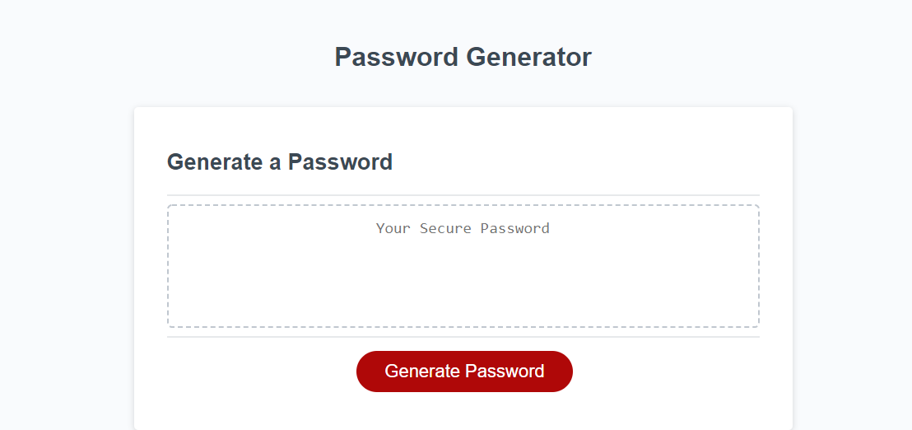

# Password Generator
​
## Table of contents
​
- [Overview](#overview)
  - [The challenge](#the-challenge)
  - [User Story](#user-story)
  - [Acceptance Criteria](#acceptance-criteria)
  - [Screenshot](#screenshot)
  - [Links](#links)
- [My process](#my-process)
  - [Built with](#built-with)
  - [What I learned](#what-i-learned)
  - [Continued development](#continued-development)
  - [Useful resources](#useful-resources)
- [Author](#author)
- [Acknowledgments](#acknowledgments)

​
## Overview
​
### The challenge
​
This challenge is an on the job type of format; it requires me to use starter code to make an application that will enable the user to generate random passwords that fulfill user criteria input.  This application runs in the browser and features dynamically updated HTML and CSS powered by JavaScript code that I have written.  It has a responsive UI that can adapt to multiple screen sizes.

### User Story
​
AS AN employee with access to sensitive data
I WANT to randomly generate a password that meets certain criteria
SO THAT I can create a strong password that provides greater security
​
### Acceptance Criteria
​
GIVEN I need a new, secure password
WHEN I click the button to generate a password
THEN I am presented with a series of prompts for password criteria
WHEN prompted for password criteria
THEN I select which criteria to include in the password
WHEN prompted for the length of the password
THEN I choose a length of at least 8 characters and no more than 128 characters
WHEN asked for character types to include in the password
THEN I confirm whether or not to include lowercase, uppercase, numeric, and/or special characters
WHEN I answer each prompt
THEN my input should be validated and at least one character type should be selected
WHEN all prompts are answered
THEN a password is generated that matches the selected criteria
WHEN the password is generated
THEN the password is either displayed in an alert or written to the page
​
### Screenshot
​

​
### Links
​
- Solution URL: [https://github.com/Unicorn-Barf/challenge_3](https://github.com/Unicorn-Barf/challenge_3)
- Live Site URL: [https://unicorn-barf.github.io/challenge_3/](https://unicorn-barf.github.io/challenge_3/)
​
## My process
​
### Built with
​
- HTML5 Markup
- CSS
- JavaScript
​
### What I learned
​
This project was an on the job type of challenge.  The HTML and CSS were complete, so the main focus was writing JavaScript to generate a random password.  Through this, I learned how to interact with the user using `alert()` and `confirm()` to get necessary data input.  In addition, I used array methods to manipulate data and make my code more concise.  Finally, it was necessary to utilize `if` statements and `while` loops; they came in handy when tell my code what data to use when generating the password as well as making sure the user input valid responses.\
\
Here is an example of my use of `prompt` to get the user's desired password length.  In order to ensure the input was valid, I called a `while` loop to check if the input was a valid length value and if it was an integer.  If it wasn't, then the user is prompted again to re-enter a proper value.

```js
  // Write Promts for user to specify Length
  passLength = prompt("Enter length of password (8-128 characters)");
  // Re-prompts user if the value entered is not in the specified range or isn't an integer
  while (passLength < 8 || passLength > 128 || passLength % 1 > 0) {
    passLength = prompt("Not a valid length.  Enter length of password (8-128 characters)");
  }
```
Here is an example of how I learned to use array methods to quickly create the arrays that I wanted to generate a password.  By using arrays methods, I only had to type out the alphabet once to create two separate arrays with 26 individual lowercase and uppercase character values.
```js
  let lower = "abcdefghijklmnopqrstuvwxyz";
  let upper = lower.toUpperCase();
  lower = lower.split('');
  upper = upper.split('');
  ```
​
​
### Continued development
​
This challenge ispired me to find new ways to manipulate data within arrays.  In the future I want to understand how to do similar method use with objects as my skills advance.

### Useful resources
​
- [Array Methods W3 Schools](https://www.w3schools.com/js/js_array_methods.asp) - This is a great reference to different common array methods and how they are used to modify and manipulate arrays.
- [Backslash Character](https://www.afterhoursprogramming.com/tutorial/javascript/backslash-characters/) - This was a helpful resource to understand the backslash character and its escape characteristics.

​
## Author
​
**Nolan Spence**
- GitHub - [https://github.com/Unicorn-Barf](https://github.com/Unicorn-Barf)
- LinkedIn - [https://www.linkedin.com/in/aerospence/](https://www.linkedin.com/in/aerospence/)
​
## Acknowledgments
​
My tutor, Jacab Nordan, had a great conversation with my about the backslash character.  I ultimately decided to keep it out of my special characters because it is unique and carries a special function.  It is the escape character.  When used on itself, it was entering two backslashes into my array.  I will look into this more in the future.